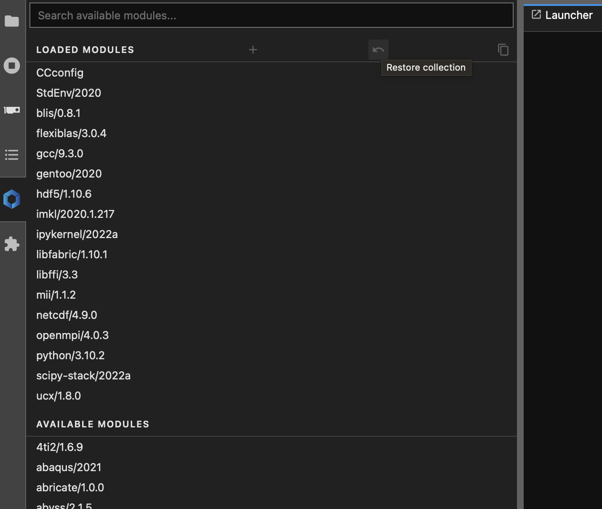
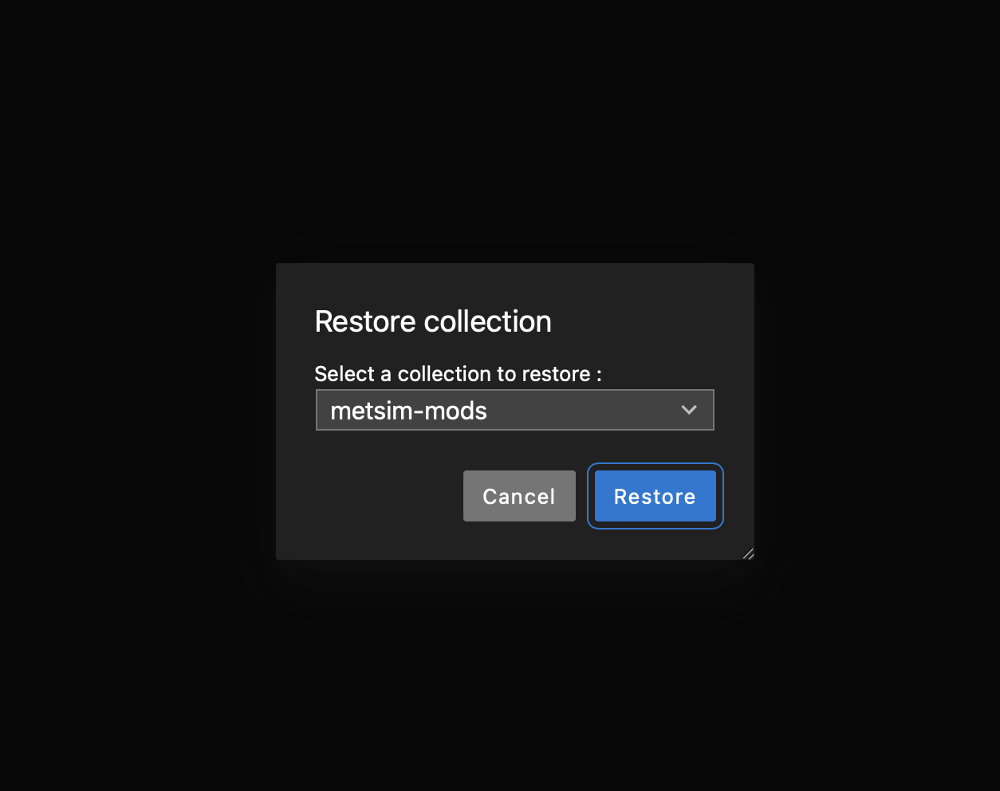
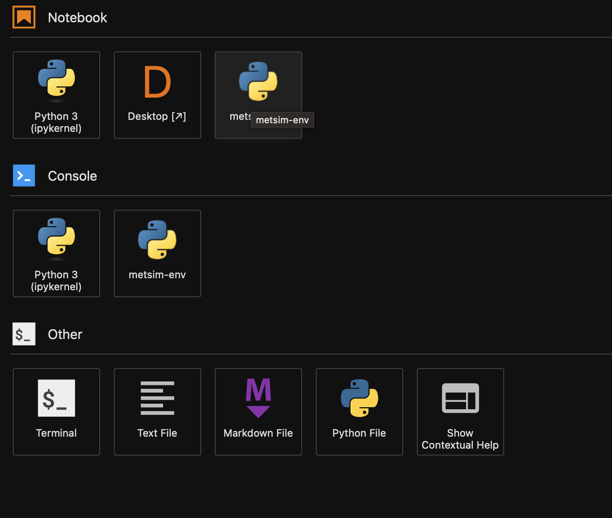

# metsim-env-narval
Virtual Environment to run Metsim on DA Narval

# Setting up `MetSim`
In order to set up `MetSim`'s virtual environment in Python on [DA Narval](https://docs.alliancecan.ca/wiki/Narval/en), follow the code snippet below:

```console
foo@bar:~$ git clone https://github.com/kasra-keshavarz/metsim-env-narval/
foo@bar:~$ cd metsim-env-narval/
foo@bar:~$ ./create-venv.sh
```

# Use JupyterHub
1. Visit [Narval's JupyterHub Webpage](https://jupyterhub.narval.computecanada.ca/hub/login) and use your Narval credentionals to launch a Jupyterlab Notebook.
2. Load the `metsim-mods` from the `lmod` extension of your Jupyter session, and then choose the `metsim-env` kernel to do your computations.



3. Happy computing!

# Issues
Open a ticket under the [Issues](./Issues) tab to report a problem.

# License
MetSim Virtual Environment on Narval
Copyright (C) 2023, University of Calgary <br>  


This program is free software: you can redistribute it and/or modify it under the terms of the GNU General Public License as published by the Free Software Foundation, either version 3 of the License, or (at your option) any later version.

This program is distributed in the hope that it will be useful, but WITHOUT ANY WARRANTY; without even the implied warranty of MERCHANTABILITY or FITNESS FOR A PARTICULAR PURPOSE. See the GNU General Public License for more details.

You should have received a copy of the GNU General Public License along with this program. If not, see http://www.gnu.org/licenses/.
